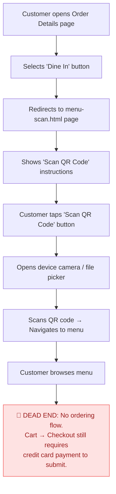
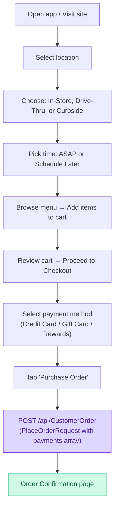
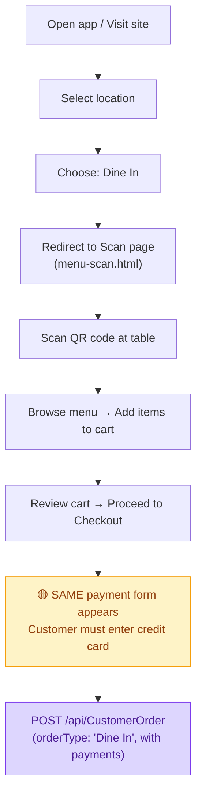
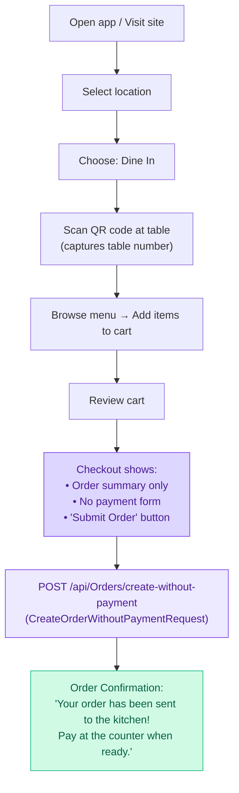

# Revised Integration Plan: Order API Endpoints

---


**Date:** 2026-06-07  
**Conversation ID:** `9d8dce57-99ac-4009-8c3f-3cf4e964de64`


---

## Implementation Plan

## Background: Two Separate Order API Systems

After a thorough audit of the Swagger spec and your current front-end code, here's what I found. Your backend actually has **two completely separate sets of order endpoints** — and this is key to understanding everything:

### System 1: `CustomerOrder` (What the front-end uses today)

| Method | Endpoint | Purpose |
|---|---|---|
| **POST** | `/api/CustomerOrder` | Place order for **logged-in** user |
| **POST** | `/api/CustomerOrder/guest` | Place order for **guest** user |
| **GET** | `/api/CustomerOrder/{orderId}` | Get order details |
| **PUT** | `/api/CustomerOrder/{orderId}/cancel` | Cancel order |

- **Schema used**: `PlaceOrderRequest` — a flat object with `orderType`, `locationId`, `restaurantId`, `items[]`, and an **optional** `payments[]` array.
- **Currently wired in** [api.js](file:///Users/michael-riley/GitHub%20Repositories/FB-OLO-Revamp/farebites-OLO-Revamp/api.js#L156-L163) as `placeOrder()` and `getOrderDetails()`.
- **Called from** [app.js](file:///Users/michael-riley/GitHub%20Repositories/FB-OLO-Revamp/farebites-OLO-Revamp/app.js#L9491) in the `_handlePlaceOrder()` function.

### System 2: `Orders` (The newer endpoints you're asking about)

| Method | Endpoint | Purpose |
|---|---|---|
| **POST** | `/api/Orders/create` | Create order **with** payment records |
| **POST** | `/api/Orders/create-without-payment` | Create order **without** payment records |
| **GET** | `/api/Orders/details/{orderId}` | Get detailed order info |
| **GET** | `/api/Orders/{orderId}` | Get order by ID |
| **PUT** | `/api/Orders/{orderId}/complete` | Mark order completed |
| **PUT** | `/api/Orders/{orderId}/readyforpickup` | Mark ready for pickup |
| **PUT** | `/api/Orders/{orderId}/confirmorder` | Confirm order |
| **PUT** | `/api/Orders/{orderId}/confirmcancel` | Confirm cancellation |
| **POST** | `/api/Orders/{orderId}/void` | Void an order |
| **POST** | `/api/Orders/{orderId}/messagecustomer` | Message the customer |

- **Schema used**: `CreateOrderRequest` — a **nested** object with `order` (a `CreateOrderDto`), `orderMenuItems[]` (array of `CreateOrderMenuItemDto`), and `payments[]` (array of `CreatePaymentDto`).
- **Not currently wired** into the front-end at all.

---

## Key Difference: Payload Structure

> [!IMPORTANT]
> These two systems expect **completely different JSON structures**. You cannot just swap the URL — the payload shape must change too.

### Current payload (System 1 — `PlaceOrderRequest`):
```json
{
  "orderType": "In-store",
  "locationId": 7,
  "restaurantId": 7,
  "tipAmount": 1.50,
  "pickUpTime": null,
  "isCustomTime": false,
  "tableNum": null,
  "isGuestUser": false,
  "guestFirstName": "John",
  "payments": [{ "paymentToken": "tok_xxx", "paymentMethodType": "card", "amount": 12.50 }],
  "items": [
    { "menuItemId": 120, "quantity": 1, "specialInstruction": null, "subItems": [...] }
  ]
}
```

### New payload (System 2 — `CreateOrderRequest`):
```json
{
  "order": {
    "locationId": 7,
    "restaurantId": 7,
    "customerId": 42,
    "platformId": 1,
    "orderType": "In-store",
    "subTotal": 10.50,
    "salesTax": 0.97,
    "total": 12.50,
    "tipApplied": 1.50,
    "pickUpTime": null,
    "isGuestUser": false,
    "guestFirstName": "John"
  },
  "orderMenuItems": [
    { "menuItemId": 120, "quantity": 1, "paidPrice": 5.75, "specialInstruction": null }
  ],
  "payments": [
    { "paymentTypeId": 1, "paymentAmount": 12.50, "confirmationNumber": "conf_xxx", "truncCreditNum": "4242" }
  ]
}
```

Notice how System 2 is much more explicit — the front-end must calculate and send `subTotal`, `salesTax`, `total`, and `paidPrice` per item, rather than letting the server compute it.

---

## Current Dine In Workflow (As It Exists Today)

You're exactly right — the site does **not** currently facilitate placing a dine-in order end-to-end. Here's the actual flow right now:



In other words, clicking "Dine In" today is **purely a menu-viewing experience**. The customer can:
1. Scan a table QR code
2. Browse the menu
3. Add items to their cart

But when they get to checkout, **they still hit the full payment form** (credit card, gift card, etc.), and the order still goes through the standard `PlaceOrderRequest` endpoint with `orderType: "Dine In"`. There is **no bypass** that skips payment for dine-in customers.

---

## Full Workflow Walkthrough: All Order Types

### 🏪 In-Store Pickup / Drive-Thru / Curbside (Today — Working)



**This works end-to-end today.** The front-end calls `ApiService.placeOrder()` → `POST /api/CustomerOrder`.

---

### 🍽️ Dine In — Current (Incomplete)



**The gap**: For a true dine-in experience (order at your table, pay later at the counter), the checkout should **skip payment entirely** and call a different endpoint.

---

### 🍽️ Dine In — Proposed (With `create-without-payment`)



---

## User Review Required

> [!WARNING]
> **Which order system should we target?**  
> The front-end currently uses **System 1** (`/api/CustomerOrder`). The new endpoints you're asking about are **System 2** (`/api/Orders/create`). These are completely different APIs with different payload shapes. Before we write any code, we need to know:
> 1. Are both systems active in production? Or is System 2 meant to replace System 1?
> 2. Should we migrate existing pickup/in-store orders to System 2 as well, or only use System 2 for the new dine-in (no-payment) flow?

> [!IMPORTANT]
> **Dine-in: Is this a priority right now?**  
> The current dine-in flow just funnels into the standard payment checkout. Building a true "order without payment" dine-in experience would require:
> - A modified checkout page that hides the payment section when `fulfillmentMode === "Dine In"`
> - Capturing the `tableNum` from the QR code scan
> - Wiring up the new `POST /api/Orders/create-without-payment` endpoint
> - A different order confirmation message ("Pay at the counter" vs. "Payment received")
> 
> This is meaningful work. Should we prioritize it, or keep it as a future phase?

## Open Questions

1. **Ask your developer**: Which order system is the "primary" one going forward — `CustomerOrder` or `Orders`? Or do they serve different purposes (customer-facing vs. internal/merchant)?
2. **Gift cards in System 2**: The `CreatePaymentDto` schema has fields for `paymentTypeId`, `confirmationNumber`, `truncCreditNum`, and `creditCardType`. Gift cards would likely just be a different `paymentTypeId`. Confirm with your developer.
3. **Table number from QR code**: Does the QR code at the table encode the table number? If so, what format? We'd need to parse it and pass it as `tableNum` in the order payload.
4. **Guest dine-in**: Can a guest (not logged in) place a dine-in order? The `CreateOrderDto` has `isGuestUser` and guest name fields, but we need to confirm if the `create-without-payment` endpoint requires authentication.

## Proposed Changes (If Approved)

### Phase 1: Wire up new `Orders` endpoints in `api.js`
#### [MODIFY] [api.js](file:///Users/michael-riley/GitHub%20Repositories/FB-OLO-Revamp/farebites-OLO-Revamp/api.js)
- Add `createOrder(orderDto, menuItems, payments)` → `POST /api/Orders/create`
- Add `createOrderWithoutPayment(orderDto, menuItems)` → `POST /api/Orders/create-without-payment`
- Add `getOrderDetailsV2(orderId)` → `GET /api/Orders/details/{orderId}`

### Phase 2: Modify checkout for dine-in
#### [MODIFY] [app.js](file:///Users/michael-riley/GitHub%20Repositories/FB-OLO-Revamp/farebites-OLO-Revamp/app.js)
- In the checkout page renderer (~line 6897), conditionally hide the payment method section and tip section when `fulfillmentMode === "Dine In"`
- In `_handlePlaceOrder()` (~line 9415), add branching:
  - If `Dine In` → build `CreateOrderWithoutPaymentRequest` payload → call `createOrderWithoutPayment()`
  - Otherwise → continue using existing `placeOrder()` (or migrate to `createOrder()` if directed)
- Update order confirmation page to show "Pay at the counter" messaging for dine-in orders

### Phase 3: QR code table number capture
#### [MODIFY] [app.js](file:///Users/michael-riley/GitHub%20Repositories/FB-OLO-Revamp/farebites-OLO-Revamp/app.js)
- In `handleQRCameraCapture()`, parse the QR code data to extract a table number
- Store it in `mockupState.tableNum`
- Pass it through in the order payload

## Verification Plan

### Manual Verification
1. **Pickup order**: Place a standard In-Store order → verify it still calls `/api/CustomerOrder` and works as before (no regression)
2. **Dine-in order**: Select Dine In → scan QR → add items → checkout → verify payment section is hidden → verify it calls `/api/Orders/create-without-payment` → verify confirmation shows "pay at counter" messaging
3. **Network tab check**: Inspect the actual JSON payloads in Chrome DevTools to confirm they match the expected schemas
